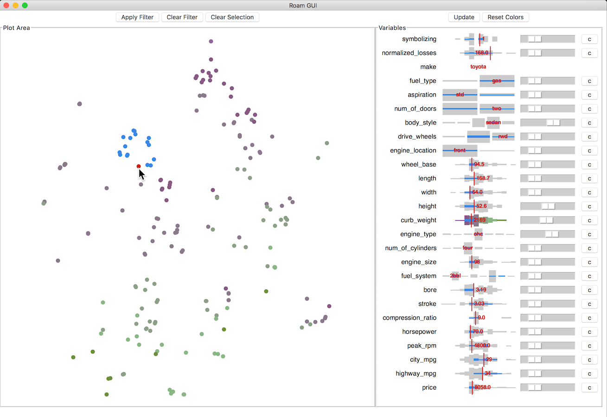

# ROAM: A Neighborhood Explorer based on t-SNE

Please see the LICENSE.

## Overview

Roam is an experiment in visual interaction employing t-SNE scatterplots as a way to overview and select data.

The basic features of Roam are:

- Main view shows a t-SNE overview of all data.
- Variable list (on right) shows names and distributions of all variables (quantitative and qualitative).
- Slides next to each variable may be used to adjust weight (degree of influence) of that variable on the plot.
- The Color (c) button next to each slider will color the scatterplot by that variable.
- The main plot supports:
  - selection,
  - hover for details, and
  - filtering by selection.

## Getting Started

Roam is written for Python 3.

In addition, you will need the following packages installed:

- numpy
- scipy
- scikit-learn
- pandas
- matplotlib
- bottle
- requests
- munch

## Running Roam 

Once you have installed the necessary dependencies, you can start the server and client programs using the following commands.

    cd src
    
    # run the server process
    ./roamserver.py ../data/automobiles.csv & 
    
    # run the GUI (uses server)
    ./roamgui.py
